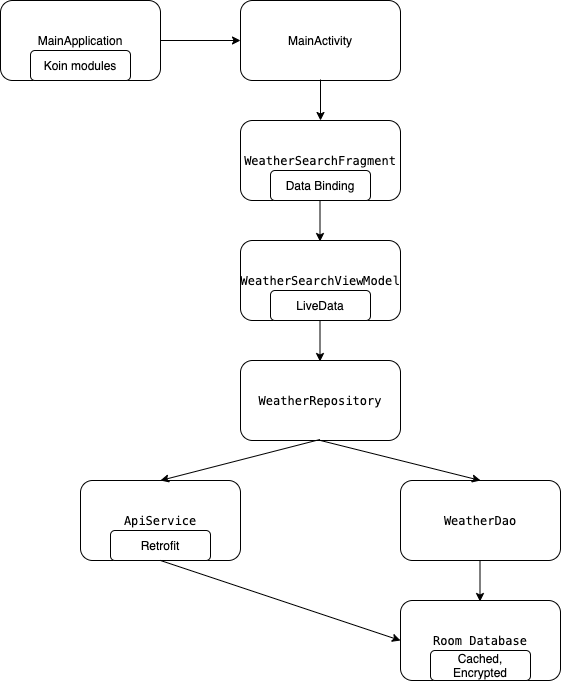

# Open Weather Application
```bash
git clone https://github.com/hoanle/ow.git
```
NOTE: The project is built with both newly-released Android Studio (4.1.1) and Kotlin, there could be conflicted issues on defferent local machine

## **1. Application Architecture:**
- Application Architecture: **MVVM with LiveData**
- Dependency Injection Framework: **Koin**
- Networking: **Retrofit 2**
- Database: **Room**
- Multithreading: **Reactivex**
- Encryption: **Base64 and sqlcipher**
- Testing: **JUnit4, Hamcrest, Room testing, LiveData testing, mockk**



## **2. Project folders structure:**
- /config: App configurations and constant
- /data/model: Models of the app
- /data/network: Network client and interface
- /data/repository: Repository and App database
- /di: Modules for DI
- /ui/activity, /ui/fragment, /ui/adapter: UI classes
- /view_model: ViewModel classes
- /util: Other facilities and helper

## **3. Development environment:**
- Android Studio 4.1.1
- Min SDK 23
- Target SDK 29
- Build variant:
-- ./gradlew assembleDebug
-- ./gradlew assembleRelease
- To run at local
-- Clone the project by the link above
-- Option 1: Use Android Studio, open project, wait until the project is built, use Run button to run on emulator or device
-- Option 2: At project's root folder, run command `./gradlew assembleDebug`, the apk will be built and be at folder 'app/build/outputs/apk/debug'. Use the apk to install on devices.

##### Keystores:
- No Keystore is uploaded. Should only configured at local

## **4. Check list:**
- [x] The application is a simple Android application which is written by Java/Kotlin.
- [x] The application is able to retrieve the weather information from OpenWeatherMaps API.
- [x] The application is able to allow user to input the searching term.
- [x] The application is able to proceed searching with a condition of the search term length
must be from 3 characters or above.
- [x] The application is able to render the searched results as a list of weather items.
- [x] The application is able to support caching mechanism so as to prevent the app from
generating a bunch of API requests. The cache is set at 1 hour
- [x] The application is able to manage caching mechanism & lifecycle.
- [x] The application is able to handle failures.
